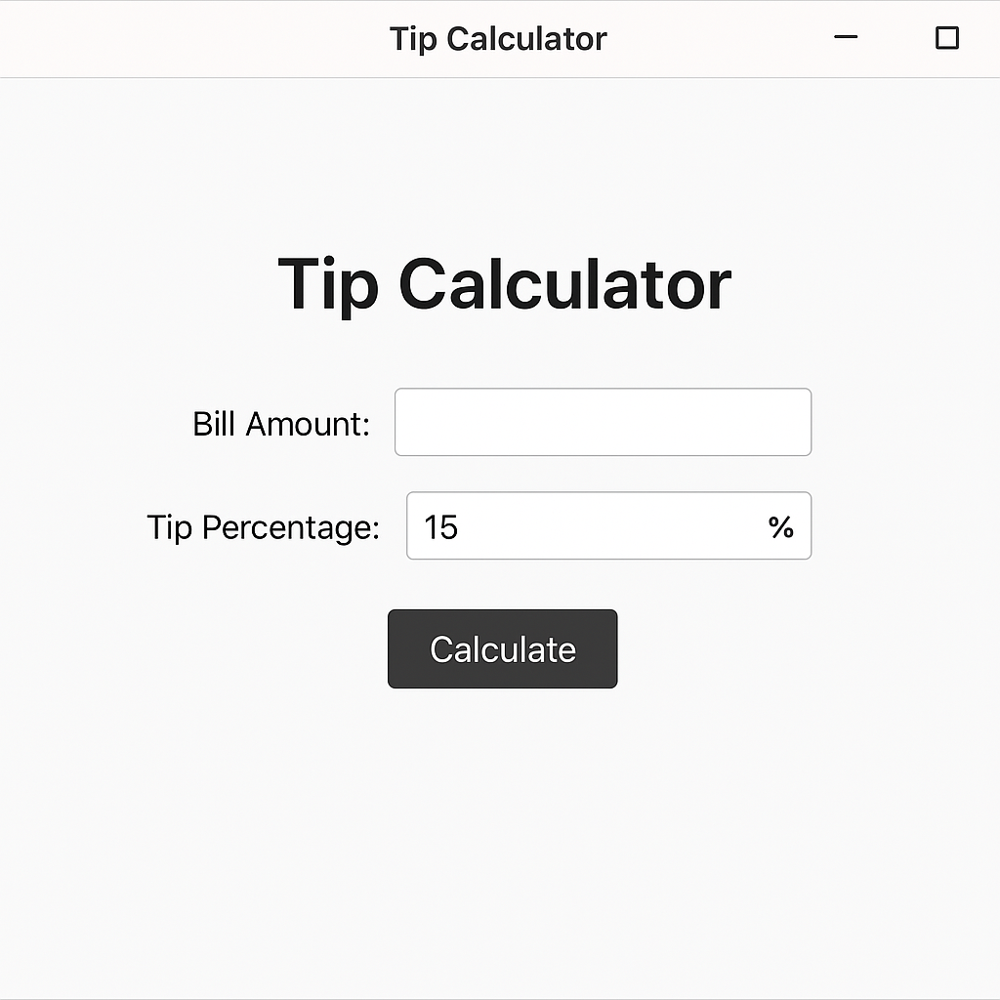
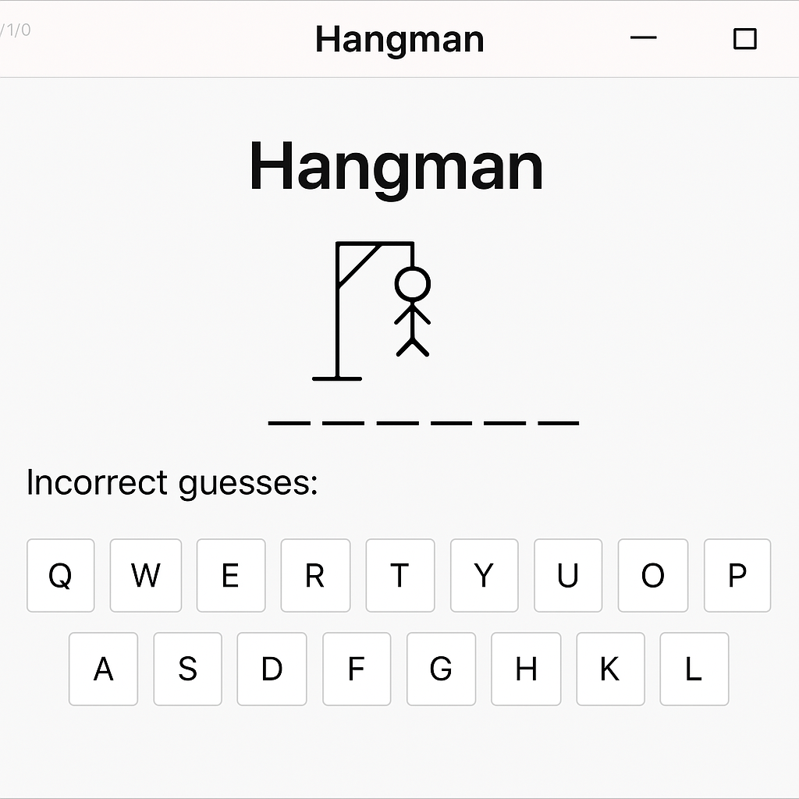
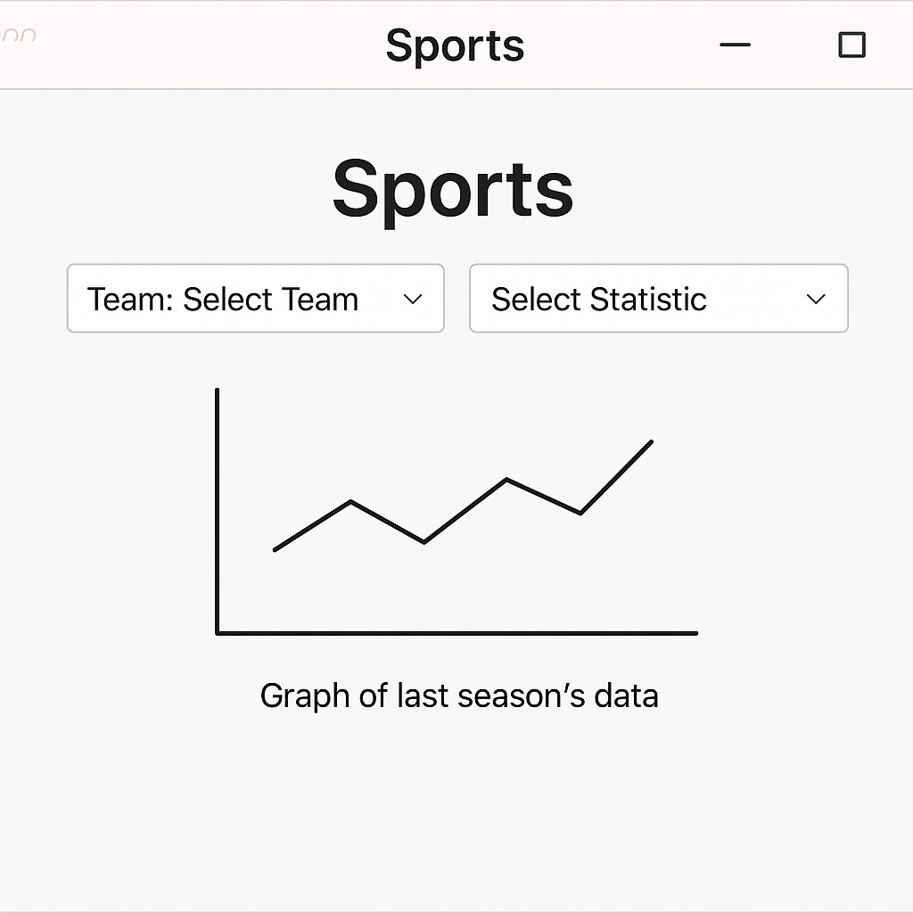
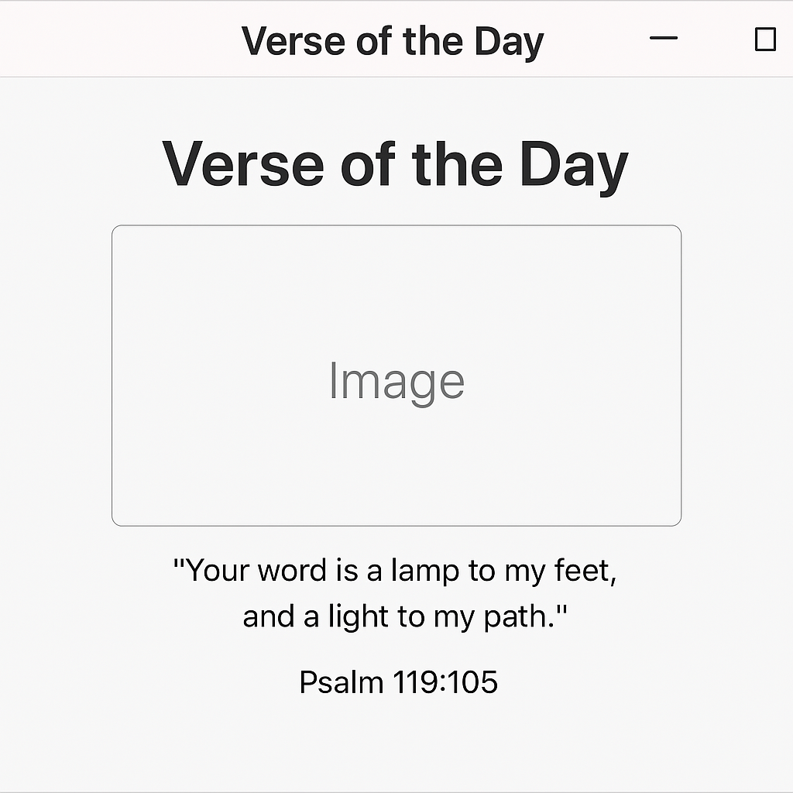
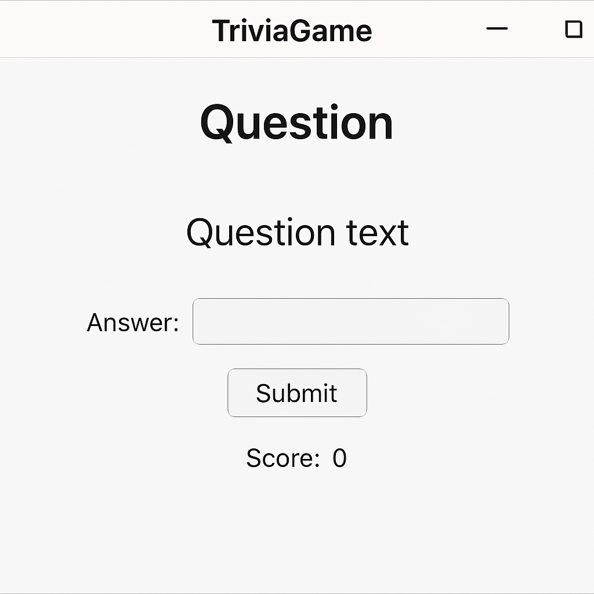
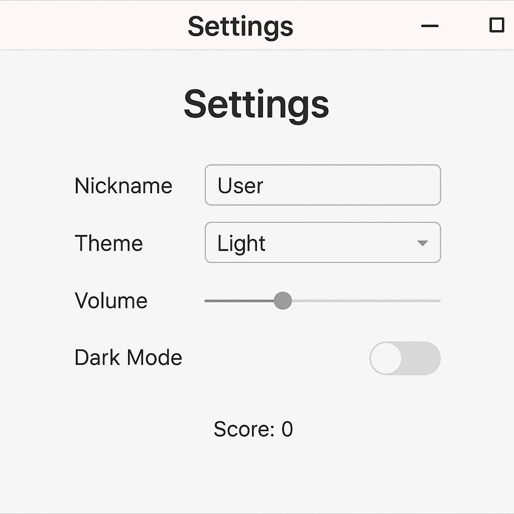

# CIS332_SoftwareEng_Final (Swiss Army App)

## 1. Team Members
- **Bogdan Mygovych**   
- **Tykhyk Zolotarov**  
- **Jonah Yurkanin**
- **Jessica Avery** 

## 2. Objective / Summary

Highlander Industries has hired our team to build a desktop application called **Swiss Army App**, designed to entertain clients in their downtown Philadelphia waiting room. These clients often travel internationally and may be visiting Philadelphia for the first time. The app includes multiple activities and games to help users pass time and stay engaged while waiting for their consulting appointments.

## 3. Installation and Usage

## 4. Requirements for System

- **Java Version:** Java 17 or later  
- **Framework:** JavaFX  
- **IDE:** IntelliJ IDEA, or any IDE with JavaFX support  
- **Operating Systems:** Windows, macOS, or Linux 
- **Internet Access:** Required for sports data and Bible verse content (if API is used)  

## 5. User Requirements (User Stories)

- As a user, I want to enter a nickname so the app can personalize my experience.
- As a user, I want a landing page with the company logo to welcome me.
- As a traveler, I want to use a tip calculator so I can split bills easily while traveling.
- As a gamer, I want to play a game like Hangman or Madlibs to stay entertained.
- As a sports fan, I want to choose a sports team and view last season’s stats in graph form.
- As a user, I want to see a random Bible verse with a daily image for inspiration.
- As a user, I want to play a fun trivia game.
- As a user, I want to change my nickname and adjust app-wide settings in the Settings screen.
- As a user, I want an easy-to-navigate interface.

## 6. UML Diagrams

## 7. UI Mockups

<table>
  <tr>
    <td><strong>Tip Calculator</strong></td>
    <td><strong>Hangman Game</strong></td>
  </tr>
  <tr>
    <td></td>
    <td></td>
  </tr>
  <tr>
    <td><strong>Sports Stats</strong></td>
    <td><strong>Verse of the Day</strong></td>
  </tr>
  <tr>
    <td></td>
    <td></td>
  </tr>
  <tr>
    <td><strong>Trivia Game</strong></td>
    <td><strong>Settings Page</strong></td>
  </tr>
  <tr>
    <td></td>
    <td></td>
  </tr>
</table>
